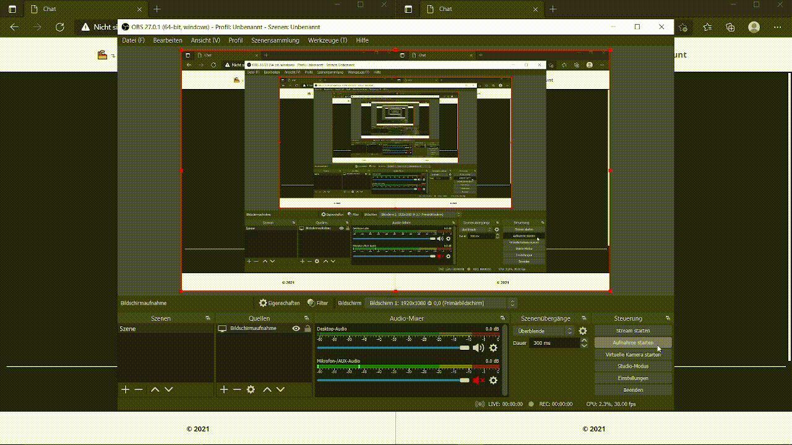

Modern Webchat (in work)

What you need:
  - NodeJs
  - Postgresql

Password encryption:
  - SHA256

Authentification:
  - Server Side
  - No more logged in after reload (maybe change that)

Databasemodel

